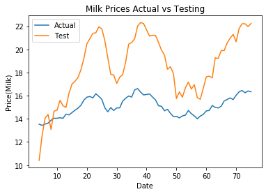

# Predicting Future Milk Prices

To predict future milk prices data was gathered from <a href="usda.gov">usda.gov</a>. I wanted to tacklet his problem from an idea I got during a job interview, yes the interview was for a Dairy company. There are many tutorials out there for trying to predict stock prices and bitcoin prices, but I couldn't find one on predicting milk prices. So, this is a preliminary attempt at tackling the problem.

## The Data

The features being used to predict the prices will be Barrel Cheddar and Block Cheddar sales, and historical milk prices for the dates July, 1997 to June, 2016.

## The Model

The model being used was an LSTM model that took the past 4 weeks of data to try to predict the current weeks price.

### Predictions vs Actual Data

The model wasn't very accurate. Adding more data or trying a traditional machine learning model might yield better results.